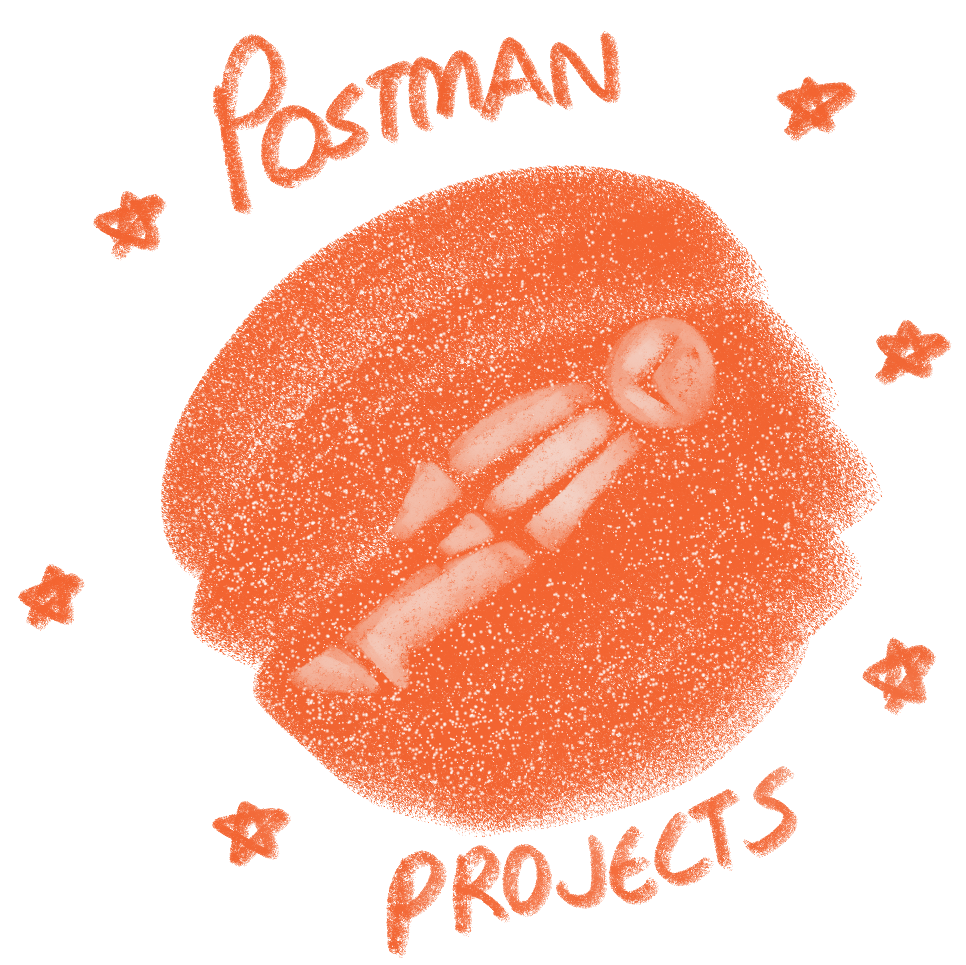

# Postman API Project

  

---

A collection of projects utilizing Postman, exploring Newman, Docker, and GitHub Actions: demonstrating fundamentals in REST APIs, automation, and test validation.

---

## Projects

### 1. [Cafe & Wi-Fi API Test](https://github.com/wooyeoup-rho/postman-api-projects/tree/main/cafe-api-tests)

A REST API for managing cafe data with automated testing using **Postman**, **Newman**, and CI/CD Integration with **Docker** and **GitHub Actions**.

   